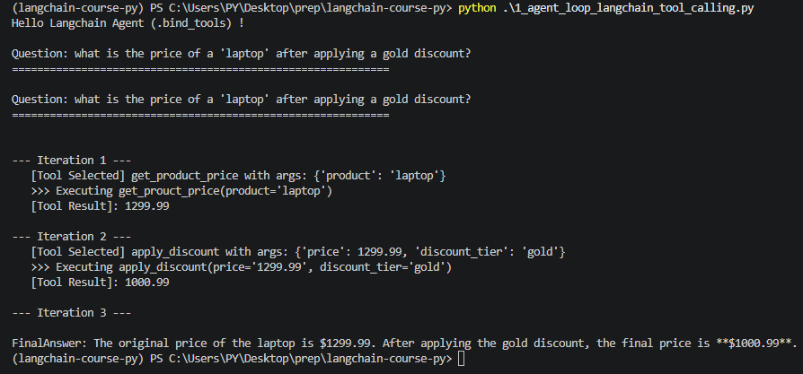
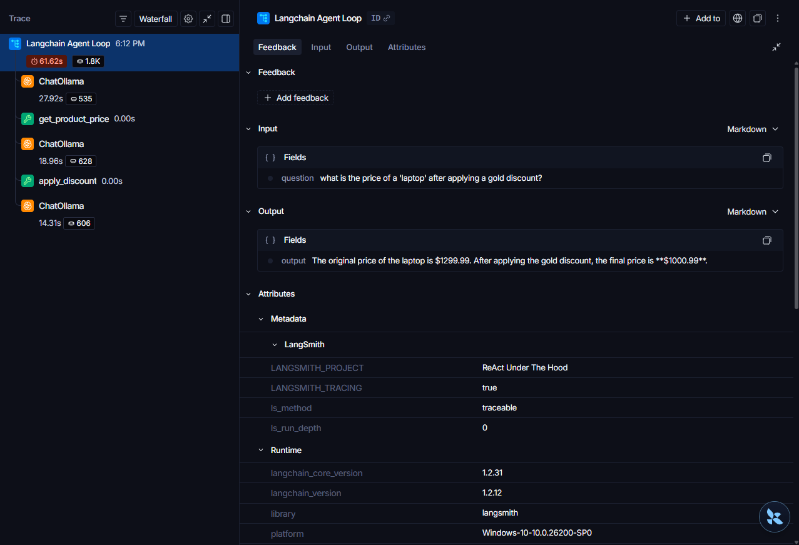

## Project React-Search_agent
1. command: `uv add langchain langchain-openai langchain-tavily tavily-python python-dotenv black isort` 
2. for google gemini: use langchain-google-genai

3. untill we use some structed output we are going to get an unstructed object, which is JSON, to make the output more human friendly we need to use structed outputs.

## pre-requisite
**Add a `.env` file in the root with following contents:**
```
LANGSMITH_TRACING=true
LANGSMITH_API_KEY=<<YOUR LangSmith API Key>>
LANGSMITH_PROJECT=<<give some project name, e.g.: ReAct Under The Hood>>
```

## Tool Calling

> Output:
1. 
2. LangSmith Traces: https://smith.langchain.com/public/bc3d397c-b115-4b43-861c-19f809c2742c/r
